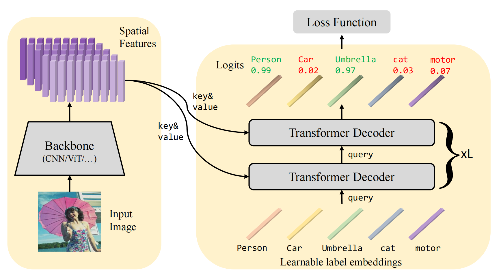
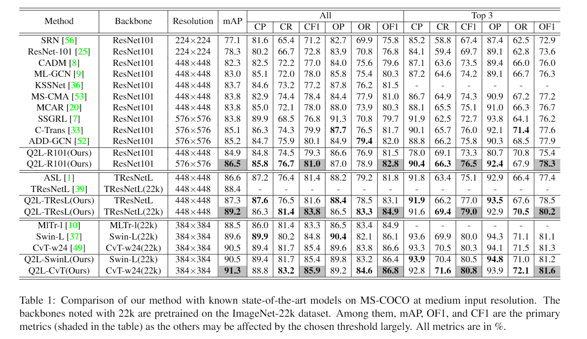

[](https://paperswithcode.com/sota/multi-label-classification-on-ms-coco?p=query2label-a-simple-transformer-way-to-multi)
[](https://paperswithcode.com/sota/multi-label-classification-on-nus-wide?p=query2label-a-simple-transformer-way-to-multi)
[](https://paperswithcode.com/sota/multi-label-classification-on-pascal-voc-2007?p=query2label-a-simple-transformer-way-to-multi)
[](https://paperswithcode.com/sota/multi-label-classification-on-pascal-voc-2012?p=query2label-a-simple-transformer-way-to-multi)

# Introdunction
This is the official implementation of the paper ["Query2Label: A Simple Transformer Way to Multi-Label Classification"](https://arxiv.org/abs/2107.10834).
## Abstract

This paper presents a simple and effective approach to solving the multi-label classification problem. The proposed approach leverages Transformer decoders to query the existence of a class label. The use of Transformer is rooted in the need of extracting local discriminative features adaptively for different labels, which is a strongly desired property due to the existence of multiple objects in one image. The built-in cross-attention module in the Transformer decoder offers an effective way to use label embeddings as queries to probe and pool class-related features from a feature map computed by a vision backbone for subsequent binary classifications. Compared with prior works, the new framework is simple, using standard Transformers and vision backbones, and effective, consistently outperforming all previous works on five multi-label classification data sets, including MS-COCO, PASCAL VOC, NUS-WIDE, and Visual Genome. Particularly, we establish 91.3% mAP on MS-COCO. We hope its compact structure, simple implementation, and superior performance serve as a strong baseline for multi-label classification tasks and future studies.



## Results on MS-COCO:



# Quick start

0. (optional) Star this repo. 

1. Clone this repo:
```sh
git clone git@github.com:SlongLiu/query2labels.git
cd query2labels
```

2. Install [```cuda```](https://developer.nvidia.com/cuda-downloads), [```PyTorch``` and ```torchvision```](https://pytorch.org/).

Please make sure they are compatible.
We test our models on two envs and other configs may also work:
```sh
cuda==11, torch==1.9.0, torchvision==0.10.0, python==3.7.3
or
cuda==10.2, torch==1.6.0, torchvision==0.7.0, python==3.7.3
```

3. Install other needed packages.
```sh
pip install -r requirments.txt
```

4. Data preparation.

Download [MS-COCO 2014](https://cocodataset.org/#download) and modify the path in ```lib/dataset/cocodataset.py: line 24, 25```.

5. Download pretrained models.

You could download pretrained models from [this link](https://cloud.tsinghua.edu.cn/d/a1560cd327dc45d0ad8e/). See more details below.

6. Run!
```sh
python q2l_infer.py -a modelname --config /path/to/json/file --resume /path/to/pkl/file [other args]
e.g.
python q2l_infer.py -a 'Q2L-R101-448' --config "pretrained/Q2L-R101-448/config_new.json" -b 16 --resume 'pretrained/Q2L-R101-448/checkpoint.pkl'
```

# pretrianed model

|  Modelname   | mAP | link(Tsinghua-cloud)  | 
|  ----  | ----  | ---- | 
| Q2L-R101-448  | 84.9 | [this link](https://cloud.tsinghua.edu.cn/d/a1560cd327dc45d0ad8e/) |
| Q2L-R101-576  | 86.5 | [this link](https://cloud.tsinghua.edu.cn/d/a1560cd327dc45d0ad8e/) |
| Q2L-TResL-448  | 87.3 | [this link](https://cloud.tsinghua.edu.cn/d/a1560cd327dc45d0ad8e/) |
| Q2L-TResL_22k-448  | 89.2 | [this link](https://cloud.tsinghua.edu.cn/d/a1560cd327dc45d0ad8e/) |
| Q2L-SwinL-384  | 90.5 | [this link](https://cloud.tsinghua.edu.cn/d/a1560cd327dc45d0ad8e/) |
| Q2L-CvT_w24-384  | 91.3 | [this link](https://cloud.tsinghua.edu.cn/d/a1560cd327dc45d0ad8e/) |


# Training
Training scripts will be available later. 


# BibTex
```
@misc{liu2021query2label,
      title={Query2Label: A Simple Transformer Way to Multi-Label Classification}, 
      author={Shilong Liu and Lei Zhang and Xiao Yang and Hang Su and Jun Zhu},
      year={2021},
      eprint={2107.10834},
      archivePrefix={arXiv},
      primaryClass={cs.CV}
}
```

# Acknowledgement
We thank the authors of [ASL](https://github.com/Alibaba-MIIL/ASL), [TResNet](https://github.com/Alibaba-MIIL/TResNet), [detr](https://github.com/facebookresearch/detr), [CvT](https://github.com/microsoft/CvT), and [Swin-Transformer](https://github.com/microsoft/Swin-Transformer) for their great works and codes.
Thanks to @mrT23 for sharing training tricks and providing a useful script for training.